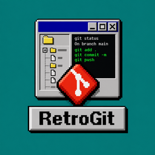

# RetroGit

<p align="center">
  
</p>

<p align="center">
  <b>A fast, lightweight Git client for macOS and Windows — with the look and feel of Windows 95.</b>
</p>

<p align="center">
  <a href="https://github.com/MadjidSahki/RetroGit/actions/workflows/ci.yml"></a>
  <a href="https://github.com/MadjidSahki/RetroGit/actions/workflows/ci.yml"></a>
  <a href="https://github.com/MadjidSahki/RetroGit/releases/latest"></a>
  
  
</p>

RetroGit is a native desktop Git client written in Rust, built for daily use: clone your
GitHub repositories, stage exactly the lines you want, commit with your hooks and signature,
explore history, review and merge pull requests — all in grey bevelled windows, with a blue
gradient title bar and a pixel font.

> Screenshot: _coming soon_

- **Small and native** — a single ~16 MB binary, no webview, no runtime
- **Quiet** — idle CPU ≈ 0 %: it redraws only when something changes
- **Everywhere you work** — macOS (Apple Silicon) and Windows (x86-64)

---

## Contents

- [Features](#features)
- [Install](#install)
- [Sign in to GitHub](#sign-in-to-github)
- [Open from a terminal and in your IDE](#open-from-a-terminal-and-in-your-ide)
- [Build from source](#build-from-source)
- [Architecture](#architecture)
- [Development](#development)
- [Credits](#credits)

---

## Features

### GitHub accounts

- Sign in with your browser (OAuth Device Flow), or paste a personal access token.
- **Several accounts at once** (personal and work): **File → Accounts…**.
- Each repository picks the account that can see it automatically; change it with
  **Repository → Account…**.
- Tokens live in the macOS Keychain / Windows Credential Manager — never on disk, never in logs.
  On macOS they are stored through Apple's `security` tool, like the GitHub CLI: updates do
  not ask for your Keychain password again — and, as for `gh` and `git`, other programs you
  run can read them through that tool.
- One list of the repositories of all your accounts: filter, then clone with progress and cancel.
- SSO-aware, and works with organizations that restrict OAuth apps (see [below](#sign-in-to-github)).

### Local work

- Staged, unstaged and untracked files, refreshed as files change.
- Colored diffs (200+ languages) with **line-level staging**: a file, a hunk or single lines.
- Discard a file, a hunk or lines (with confirmation; untracked files go to the trash).
- Commits go through your `git`: **hooks and GPG/SSH signing just work**.
- Amend the last commit; add files or extensions to `.gitignore`.

### History and branches

- Commit graph of all branches, with colored lanes and ref labels.
- Commit details: message, signature status, changed files and their diff.
- Branches: create, switch (stashing your changes if needed), rename, delete, publish.
- Fetch, pull (fast-forward, merge or rebase) and push, with progress and cancel.
- Right-click a commit to **cherry-pick, revert, reset, rebase interactively, tag it** or
  **browse its files**.
- **Interactive rebase**: reorder, pick, reword, squash, fixup or drop — pushed commits are flagged.
- **Stashes** tab: stash, browse, apply, pop, drop.
- **Tags**: create (lightweight or annotated), delete (also on origin), push.

### Conflicts

- A three-pane editor (**Mine | Result | Theirs**) for merges, pulls, rebases, stashes and switches.
- Per block: use mine, theirs or both — or keep one side for the whole file.
- The result stays editable; **Mark resolved** opens the next conflicted file.
- Continue, Skip and Abort for merges, rebases, cherry-picks and reverts.
- Your edits are never lost silently.

### Explore the code

- **Explore** tab: the files of any version — HEAD, a branch, a tag or a commit.
- **Blame**: who changed each line, grouped by commit and shaded by age; go back with
  **Blame the parent of this commit**.
- **File history**, following renames, with the file's diff in each commit.
- **Search in files**: exact text, match case, path filter; a click opens the file at the line.
- **History filter**: find commits by message, author, hash or changed text.
- Everything runs in the background and can be cancelled.

### Pull requests

- Lists: open, mine, review requested, closed — with checks, reviews and labels.
- Read the description, the conversation, the commits, the files and the checks.
- **Create** a pull request from the current branch (publishing it first if needed).
- **Review**: comment on lines or ranges, approve, request changes, reply, resolve.
- **Suggestions**: write them, and apply the ones you receive as a local commit.
- Edit the title, description, reviewers, assignees, labels; draft ↔ ready for review.
- **Merge, squash or rebase** — the button tells you why when GitHub would refuse.
- Check out a pull request, forks included.

### Notifications

- Checks passed or failed, reviews, comments, merged or closed — for all your accounts.
- As system notifications under RetroGit's name — **a click opens the pull request** — and in
  the **Notifications** list.

### Comfort

- **View → Appearance**: six color schemes in the Windows 95 spirit (including **Dark** and
  two high-contrast schemes), the W95FA pixel font or **Atkinson Hyperlegible**, and the
  size (Cmd/Ctrl + / − / 0).
- **Open in IDE**: VS Code, Cursor, Visual Studio, JetBrains IDEs, Zed, Sublime Text, Xcode.
- **`retrogit` command**: open the repository of the current folder from a terminal.
- Recent repositories; window size and position remembered.

### Updates

- RetroGit checks GitHub for a new version at start and every day (or **Help → Check for
  updates…**) and shows **Update available** in the toolbar.
- **Install and restart** downloads it, checks it against the release's SHA-256 checksums,
  replaces the app (macOS app, Windows installer or portable exe — the old copy is put back
  if anything fails) and restarts. Nothing is installed without your click; **Skip this
  version** and automatic checks can be turned off.

---

## Install

Download the latest build from the [Releases](../../releases) page:

| Platform | File |
|---|---|
| macOS (Apple Silicon) | `RetroGit-macos-arm64.zip` — the `RetroGit.app` application |
| Windows (x86-64) | `RetroGit-windows-x64-setup.exe` — installer (recommended) |
| Windows (x86-64) | `RetroGit-windows-x64.zip` — portable `retrogit.exe` |

**macOS**

1. Unzip and drag **RetroGit.app** into **Applications**.
2. The app is not notarized by Apple: the first time, macOS refuses to open it. Open
   **System Settings → Privacy & Security** and click **Open Anyway** (on macOS 14 and
   earlier, right-click the app → **Open**).
3. Allow notifications when asked: they open the pull request when clicked.

**Windows**

- Run the **installer**: it installs RetroGit for your user only (no administrator rights),
  adds it to the Start menu and to *Installed apps* (to uninstall it).
- Or unzip the **portable** `retrogit.exe` anywhere.
- The files are not code-signed: if SmartScreen appears, click **More info** → **Run anyway**.
- The installer is checked automatically on every build; notifications on Windows have not
  been tried by hand yet — feedback welcome.

[Git](https://git-scm.com/) should be installed: RetroGit uses it for commits, branches and
network operations, so your hooks, signing, SSH keys and credential helpers keep working.

---

## Sign in to GitHub

1. Open RetroGit: the **Sign in to GitHub** window appears.
2. **Standard** tab → **Sign in**, then **Open browser**, enter the code and authorize RetroGit
   (and your SSO organizations if needed).
3. Or, in the **Advanced** tab, paste a personal access token (classic, scopes `repo`, `read:org` and `workflow`).

> **Organizations that restrict OAuth apps.** Fetch, pull and push then retry with your own
> git credentials, like `git` in a terminal. For pull requests, RetroGit uses the token of the
> [GitHub CLI](https://cli.github.com/) when it is signed in (`gh auth login`) with the same
> account — read when needed, never stored.

---

## Open from a terminal and in your IDE

Use **File → Install command line tool…** once, then from any folder of a repository:

```bash
retrogit          # opens the repository of the current folder
retrogit ../other # or another folder
```

If RetroGit is already open, the repository opens in that window.

The **Open in IDE** toolbar button opens the repository in your editor; RetroGit detects the
installed IDEs and remembers your choice per repository.

---

## Build from source

Requires [Rust](https://rustup.rs/) 1.95 or newer.

```bash
git clone https://github.com/MadjidSahki/RetroGit.git
cd RetroGit
cargo build --release -p retrogit
./target/release/retrogit
```

To use your own GitHub OAuth App (Device Flow enabled, no client secret needed):

```bash
RETROGIT_GITHUB_CLIENT_ID=<your client id> cargo build --release -p retrogit
```

---

## Architecture

A Cargo workspace with four crates:

| Crate | Role |
|---|---|
| `crates/win95` | Windows 95 widget kit for [egui](https://github.com/emilk/egui): bevels, buttons, title bar, lists, dialogs, tabs, color schemes |
| `crates/gitcore` | Git API: status, diff, staging, commit, history, branches, sync, rebase, stashes, tags, blame, search. Reads with libgit2 ([git2](https://github.com/rust-lang/git2-rs)), writes with the `git` command line |
| `crates/github` | GitHub client: REST and GraphQL, OAuth Device Flow, token storage, pull request watch |
| `crates/app` | The application: state (a pure reducer), background workers and the screens |

- The UI thread never blocks: it sends commands to a worker thread and applies the events it
  sends back; Explore requests run on their own threads.
- For github.com remotes, the token reaches `git` through `GIT_ASKPASS` (answered by the
  RetroGit binary itself), never on the command line.

---

## Development

```bash
cargo fmt --all --check
cargo clippy --workspace --all-targets -- -D warnings
cargo test --workspace
```

- Tests use temporary repositories, a local bare remote and a mock HTTP server: no network needed.
- `main` is protected: changes land through pull requests, each built and tested on macOS and Windows.
- Each merge into `main` publishes a release `v<major>.<minor>.<run number>` with both binaries.
- Icons are made from the full logo with `python3 scripts/make-icons.py path/to/retrogit.png` (needs Pillow).
- Each release also has `SHA256SUMS.txt`, which RetroGit checks before installing an update.
- `scripts/package-macos.sh <binary> <version> <dir>` builds and signs `RetroGit.app` (ad-hoc,
  or `MACOS_SIGN_IDENTITY`); `installer/retrogit.iss` is the Windows installer (Inno Setup 6),
  checked by `installer/test-install.ps1` in the CI.

---

## Credits

- Syntax highlighting: [syntect](https://github.com/trishume/syntect) with the syntaxes and
  themes of [bat](https://github.com/sharkdp/bat) (through [two-face](https://codeberg.org/CosmicHarper/two-face)).
- Fonts: [W95FA](https://fontsarena.com/w95fa-by-alina-sava/) by Alina Sava and
  [Atkinson Hyperlegible](https://www.brailleinstitute.org/freefont/) by the Braille Institute (SIL OFL 1.1).
- The logo includes the [Git logo](https://git-scm.com/downloads/logos) by Jason Long (CC BY 3.0).

Licenses of embedded third-party data: [THIRD_PARTY.md](THIRD_PARTY.md).
